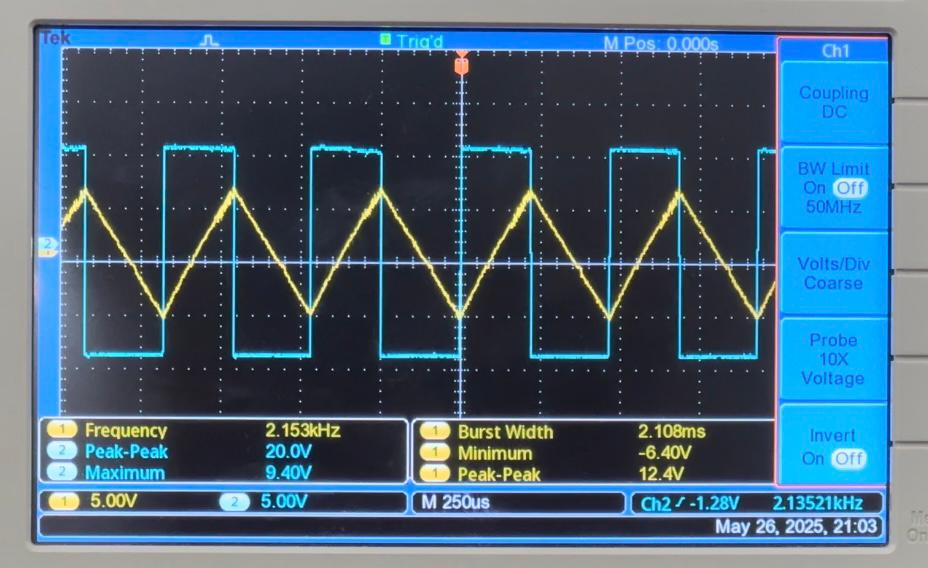

# Function Generator with Class AB Power Amplifier

A versatile waveform generator capable of producing triangular and square wave signals with adjustable amplitude, frequency, and duty cycle. Built as part of the EN2111 Electronic Circuit Design course at the University of Moratuwa.

## 🌟 Features

- **Dual Waveform Output**: Simultaneous generation of triangular and square waves
- **Adjustable Parameters**: 
  - Variable frequency control
  - Duty cycle adjustment 
  - Amplitude control (2V to 12V peak-to-peak)
- **Class AB Power Amplifier**: Drives loads up to 8Ω with minimal distortion
- **High Efficiency**: 67.7% power efficiency
- **Low Distortion**: THD < 0.5% across most frequency ranges
- **Load Isolation**: Buffer stage prevents loading effects

## 📊 Performance Specifications

| Parameter | Value |
|-----------|-------|
| **Frequency Range** | 1 kHz - 10 kHz |
| **Amplitude Range** | 2V - 12V peak-to-peak |
| **Efficiency** | 67.7% |

## 🔧 Circuit Architecture

### Core Function Generator
- **Current Source Design**: Dual constant current sources for capacitor charging/discharging
- **Schmitt Trigger**: Voltage threshold detection with hysteresis
- **Triangular Wave Generation**: Linear capacitor charging produces clean triangular waves
- **Square Wave Generation**: Schmitt trigger output provides square waves

### Power Amplifier Stage
- **Class AB Configuration**: Push-pull complementary transistor design
- **Supply Voltage**: ±10V DC
- **Output Buffer**: Isolation between generator and load
- **Zobel Network**: Load stabilization and parasitic oscillation damping

## 📐 Circuit Diagram

## 📊 Breadboard Implemetation

.jpg)

## 📈 Test Results

### Waveform Examples
//
*12V p-p, 2.153 kHz, 50% duty cycle*

//
*12V p-p, 6.472 kHz, 50% duty cycle*

//
*12V p-p, 2.358 kHz, 20% duty cycle*

//
*2V p-p, 2.227 kHz, 50% duty cycle*

## 🚧 Design Challenges & Solutions

### Challenges Encountered
1. **Loading Effects**: Direct connection to power amplifier distorted triangular waves
2. **Crossover Distortion**: Dead zone in Class AB amplifier near zero crossing
3. **Slew Rate Limitations**: Op-amp couldn't track rapid voltage changes
4. **Peak Distortion**: Inductive load caused parasitic oscillations

### Solutions Implemented
1. **Buffer Stage**: Isolated function generator from amplifier input
2. **High Slew Rate Op-Amp**: Improved tracking of rapid transitions
3. **Zobel Network**: Damped oscillations and stabilized reactive loads
4. **Enhanced Decoupling**: Additional capacitors for power supply stability

## 📚 Applications

- **Circuit Testing**: Signal injection for circuit analysis
- **Audio Electronics**: Test signal generation for amplifiers
- **Digital Systems**: Clock and timing signal generation
- **Communication Systems**: Carrier wave generation
- **Educational**: Laboratory experiments and demonstrations

## 👥 Team Members

- **Balasooriya B.A.P.I.** (220054N)
- **Dewasumithra M.P.O** (220112R)  
- **Dineshara M.C.** (220128V)
- **Diunugala C.H.** (220143L)

## 🏫 Institution

**University of Moratuwa**  
Department of Electronic and Telecommunication Engineering  
Course: EN2111 - Electronic Circuit Design

